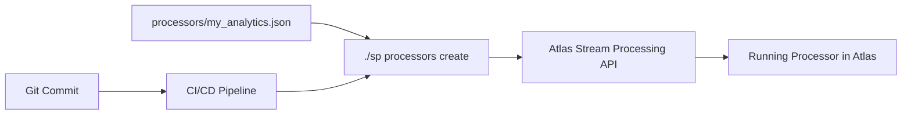

# Atlas Stream Processing Base

An AI-friendly, Copilot-optimized utility for working with MongoDB Atlas Stream Processing. This repository provides intelligent tooling designed for AI assistants to efficiently manage, profile, and optimize stream processing pipelines with natural language interactions.

## 🤖 AI-Optimized Features

- **AI-Friendly CLI** (`sp`) - Natural language compatible commands for AI assistants
- **Intelligent Automation** - Smart tier selection and performance optimization
- **Copilot Integration** - Structured for seamless AI assistant interactions  
- **Performance Analytics** - AI-readable profiling with trend analysis and recommendations
- **Declarative Configuration** - JSON-based definitions perfect for AI generation
- **Automated Testing** - Comprehensive validation tools for AI-driven development
- **Context-Aware Help** - Rich documentation and examples for AI understanding

## 📋 What's Included

### AI-Optimized Tools
- **SP CLI** (`tools/sp`) - AI-friendly command-line interface with natural language compatibility
- **Atlas API Library** (`tools/atlas_api.py`) - Intelligent API wrapper with performance insights
- **Smart Profiling** - AI-readable performance analytics with automated recommendations
- **Intelligent Tier Analysis** - Automated complexity analysis and tier selection

### Templates & Examples
- **Processor Templates** - AI-generatable stream processing pipeline examples
- **Connection Templates** - Ready-to-use database and API connection configurations
- **Development Patterns** - Best practices optimized for AI-assisted development
- **Testing Frameworks** - Comprehensive validation tools for AI-generated code

### Documentation
- **[🚀 Copilot User Guide](docs/COPILOT_USER_GUIDE.md)** - **START HERE** - The value of using SP with GitHub Copilot
- **[User Manual](docs/SP_USER_MANUAL.md)** - Complete CLI reference and examples
- **[AI Assistant Guide](docs/AI_ASSISTANT_GUIDE.md)** - Technical reference for AI interactions
- **[Performance Analysis](docs/ATLAS_STREAM_PROCESSING_PARALLELISM.md)** - Data-driven optimization guide
- **[Development Workflow](docs/DEVELOPMENT_WORKFLOW.md)** - AI-friendly development process

## 🏗️ Project Structure

```
ASP_base/
├── config.txt.example           # Atlas API credentials template
├── connections/                 # Connection definitions
│   ├── connections.json        # Database and API connections
│   └── connections.json.example
├── processors/                  # Stream processor definitions
│   ├── solar_watts_boost_processor.json
│   ├── solar_simple_processor.json
│   └── *.json.example          # Template processors
├── docs/                       # Comprehensive documentation
│   ├── SP_USER_MANUAL.md      # Complete CLI reference
│   ├── GITOPS_CICD_GUIDE.md   # GitOps deployment guide
│   ├── ATLAS_STREAM_PROCESSING_PARALLELISM.md
│   ├── TESTING_GUIDE.md       # Validation framework
│   └── *.md                   # Additional guides
├── test/                       # Testing framework
│   ├── test_processors.py     # Processor validation
│   ├── test_connections.py    # Connection testing
│   └── requirements.txt       # Test dependencies
└── tools/                      # Management toolkit
    ├── sp                     # Main CLI tool (executable)
    ├── atlas_api.py          # Core API with profiling
    └── requirements.txt      # Tool dependencies
```

## 🚀 Quick Start (AI Assistant Ready)

### Prerequisites

- **MongoDB Atlas Account** with Stream Processing enabled
- **Atlas API Keys** (generate from Atlas UI → Access Manager → API Keys)  
- **Python 3.7+** with pip

### 1. Setup Repository (Perfect for AI Assistants)

```bash
# Clone this repository
git clone https://github.com/kgorman/ASP_base.git
cd ASP_base

# Install dependencies (AI assistants can run this automatically)
pip install -r tools/requirements.txt

# Configure credentials (never commit this file!)
cp config.txt.example config.txt
# Edit config.txt with your Atlas API keys and project ID
```

### 2. Deploy Stream Processing

```bash
cd tools/

# Create Stream Processing workspace
./sp workspaces create my-workspace

# Deploy connections
./sp instances connections create

# Deploy and start processors with auto-tier selection
./sp processors create --all
./sp processors start --auto

# Monitor performance
./sp processors stats --verbose
./sp processors profile --all --duration 300
```

### 3. Validate Deployment

```bash
# Check processor health
./sp processors list

# Get performance metrics
./sp processors stats --all --verbose

# Analyze tier utilization
./sp processors tier-advise --all

# Test end-to-end pipeline
./sp workspaces connections test --require-mongodb
```

## 🎯 Core Capabilities (AI-Optimized)

### CLI Commands (Natural Language Ready)

```bash
# Workspace Management (AI assistants can automate these)
./sp workspaces list                    # List all workspaces
./sp workspaces create my-workspace     # Create new workspace  
./sp workspaces details my-workspace    # Get workspace details

# Connection Management (Perfect for AI validation)
./sp workspaces connections create      # Deploy all connections
./sp workspaces connections list        # List connections
./sp workspaces connections test        # Test with MongoDB verification

# Processor Management (AI can optimize automatically)
./sp processors create --all           # Create all processors
./sp processors start --auto           # Start with optimal tier selection
./sp processors list                   # Show processor status
./sp processors stats --verbose        # Detailed statistics

# Performance Analysis (AI-readable output)
./sp processors tier-advise --all      # Get intelligent tier recommendations
./sp processors profile --all          # Performance profiling with trends
./sp processors profile -p my_processor --continuous  # Live monitoring
```

### Smart Performance Analytics

```bash
# Time-series profiling with trend analysis
./sp processors profile --all --duration 300 --interval 30

# Continuous monitoring with threshold alerts
./sp processors profile --all --continuous --thresholds alerts.json

# Performance comparison across tiers
./sp processors start -p my_processor -t SP10
./sp processors profile -p my_processor --duration 120 --output sp10.json
./sp processors restart -p my_processor -t SP30  
./sp processors profile -p my_processor --duration 120 --output sp30.json

# Tier optimization recommendations
./sp processors tier-advise --all
```

## 🔧 GitOps & CI/CD Integration

### GitHub Actions Workflow Example

```yaml
name: Stream Processing CI/CD
on:
  push:
    branches: [main]
    paths: ['processors/**']

jobs:
  deploy:
    runs-on: ubuntu-latest
    steps:
      - uses: actions/checkout@v4
      
      - name: Test Configurations
        run: |
          cd tools
          ./sp processors test --all
          ./sp processors tier-advise --all
      
      - name: Deploy to Production
        env:
          ATLAS_PUBLIC_KEY: ${{ secrets.ATLAS_PUBLIC_KEY }}
          ATLAS_PRIVATE_KEY: ${{ secrets.ATLAS_PRIVATE_KEY }}
          PROJECT_ID: ${{ secrets.PROJECT_ID }}
        run: |
          echo "PUBLIC_KEY=$ATLAS_PUBLIC_KEY" > config.txt
          echo "PRIVATE_KEY=$ATLAS_PRIVATE_KEY" >> config.txt  
          echo "PROJECT_ID=$PROJECT_ID" >> config.txt
          cd tools
          ./sp processors create --all
          ./sp processors start --auto
          ./sp processors profile --all --duration 120
```

### Key GitOps Features

- ✅ **Declarative Configuration** - All processors defined as JSON in Git
- ✅ **Automated Testing** - Validation on every commit  
- ✅ **Performance Baselines** - Track performance over time
- ✅ **Auto Tier Selection** - Optimal resource allocation
- ✅ **Rollback Ready** - Instant rollback via Git history

See **[GitOps CI/CD Guide](docs/GITOPS_CICD_GUIDE.md)** for complete implementation details.

## 📊 Performance Features

### Intelligent Tier Selection
The SP tool automatically analyzes processor complexity and recommends optimal tiers:

```bash
./sp processors tier-advise -p complex_analytics
# Returns: SP30 recommended (Parallelism: 8, Complex operations: 4)

./sp processors start -p complex_analytics --auto
# Automatically starts on SP30
```

### Real-time Monitoring
```bash
# Live performance monitoring
./sp processors profile --all --continuous --interval 15

# Sample Output:
# === Sample 1 (15s elapsed) ===  
# analytics_processor: Memory: 245.2MB, Latency: p50=12.3ms, Throughput: 1,847/sec
# enrichment_processor: Memory: 156.7MB, Latency: p50=8.9ms, Throughput: 2,103/sec
```

### Performance Analysis
- **Time-series Monitoring** - Track metrics over time with trend analysis
- **Threshold Alerting** - Automated alerts when metrics exceed limits
- **Tier Comparison** - A/B testing across different tier configurations
- **Bottleneck Identification** - Per-operator latency and throughput analysis

## 📚 Documentation

| Document | Description |
|----------|-------------|
| **[SP User Manual](docs/SP_USER_MANUAL.md)** | Complete CLI reference with examples |
| **[GitOps CI/CD Guide](docs/GITOPS_CICD_GUIDE.md)** | Production deployment workflows |
| **[Parallelism Guide](docs/ATLAS_STREAM_PROCESSING_PARALLELISM.md)** | Tier optimization and scaling |
| **[Testing Guide](docs/TESTING_GUIDE.md)** | Validation framework and best practices |
| **[Connection Testing](docs/SP_CONNECTION_TESTING.md)** | MongoDB verification procedures |

## 🛠️ Advanced Usage

### Custom Processor Development

```json
{
    "name": "custom_analytics_processor",
    "pipeline": [
        {
            "$source": {
                "connectionName": "data_stream",
                "timeField": { "$dateFromString": { "dateString": "$timestamp" }}
            }
        },
        {
            "$addFields": {
                "processed_value": {
                    "$function": {
                        "body": "function(input) { return input * 1.5 + Math.random(); }",
                        "args": ["$raw_value"],
                        "lang": "js"
                    }
                }
            }
        },
        {
            "$merge": {
                "into": {
                    "connectionName": "analytics_output",
                    "db": "analytics",
                    "coll": "processed_data"
                },
                "parallelism": 12
            }
        }
    ]
}
```

### Multi-Environment Configuration

```bash
# Development
./sp processors start --all-tier SP10

# Staging  
./sp processors start --all-tier SP30

# Production with auto-optimization
./sp processors start --auto
```

## 🎯 Use Cases

- **Real-time Analytics** - Process streaming data with automatic scaling
- **Data Enrichment** - Enhance incoming data with computed fields
- **Alert Systems** - Monitor streams and trigger notifications
- **ETL Pipelines** - Transform and load data across systems
- **IoT Processing** - Handle sensor data streams at scale

## 🤝 Contributing

This toolkit is designed to be:
- **Cloned and Customized** for your specific use cases
- **Extended** with additional processors and connections  
- **Integrated** into your existing CI/CD workflows
- **Shared** as a foundation for stream processing projects

See the comprehensive documentation for detailed implementation guidance.

## 📄 Processor Definition: The Core Concept

### Understanding Processor Files

**Key Principle**: In this toolkit, **processors are files**. Each `.json` file in the `processors/` directory represents a complete, self-contained stream processing pipeline that can be deployed to Atlas Stream Processing.

This file-based approach provides:
- ✅ **Version Control** - Every processor change is tracked in Git
- ✅ **Reproducibility** - Identical deployments across environments  
- ✅ **Portability** - Easy to copy, share, and template
- ✅ **GitOps Ready** - Direct integration with CI/CD workflows

### Canonical Processor Structure

Every processor file follows this canonical JSON structure:

```json
{
    "name": "processor_name",
    "pipeline": [
        {
            "$source": {
                "connectionName": "input_connection",
                "timeField": { "$dateFromString": { "dateString": "$timestamp" }}
            }
        },
        {
            "$addFields": {
                "computed_field": {
                    "$multiply": ["$value", 1.5]
                }
            }
        },
        {
            "$merge": {
                "into": {
                    "connectionName": "output_connection",
                    "db": "analytics",
                    "coll": "processed_data"
                }
            }
        }
    ]
}
```

### File-to-Deployment Mapping



**The Process:**
1. **Create/Edit** processor file locally: `processors/analytics_pipeline.json`
2. **Deploy** with SP tool: `./sp processors create -p analytics_pipeline`
3. **Start** processing: `./sp processors start -p analytics_pipeline --auto`
4. **Monitor** performance: `./sp processors profile -p analytics_pipeline`

### Detailed Processor Anatomy

#### 1. **Processor Metadata**
```json
{
    "name": "solar_analytics_processor",  // Unique identifier
    // Pipeline definition follows...
}
```
- **Name**: Must be unique within your Atlas project
- **File Name**: Should match processor name (e.g., `solar_analytics_processor.json`)

#### 2. **Pipeline Stages**
The `pipeline` array contains ordered stages that process streaming data:

```json
"pipeline": [
    // Stage 1: Data Input
    {
        "$source": {
            "connectionName": "live_sensor_data",
            "timeField": { "$dateFromString": { "dateString": "$ts" }}
        }
    },
    
    // Stage 2: Data Filtering  
    {
        "$match": {
            "sensor_type": "temperature",
            "value": { "$gt": 0 }
        }
    },
    
    // Stage 3: Data Transformation
    {
        "$addFields": {
            "celsius": {
                "$divide": [
                    { "$subtract": ["$fahrenheit", 32] },
                    1.8
                ]
            },
            "processed_at": { "$now": {} }
        }
    },
    
    // Stage 4: Data Output
    {
        "$merge": {
            "into": {
                "connectionName": "analytics_db",
                "db": "sensors", 
                "coll": "temperature_readings"
            },
            "parallelism": 8  // Optional performance optimization
        }
    }
]
```

#### 3. **Stage Types Explained**

**Input Stages:**
- `$source` - Read from data streams, databases, APIs
- `$lookup` - Join with reference data

**Processing Stages:**
- `$match` - Filter data based on conditions
- `$addFields` - Compute new fields with expressions  
- `$project` - Select and reshape fields
- `$group` - Aggregate data over time windows
- `$unwind` - Flatten arrays for processing

**Output Stages:**
- `$merge` - Write to databases with upsert logic
- `$emit` - Send to external systems or APIs
- `$out` - Replace collection contents

**Advanced Stages:**
- `$function` - Custom JavaScript processing
- `$unionWith` - Combine multiple data streams
- `$densify` - Fill gaps in time-series data

### File Management Workflow

#### Creating New Processors

```bash
# 1. Create processor file
cat > processors/user_activity_analytics.json << 'EOF'
{
    "name": "user_activity_analytics", 
    "pipeline": [
        {
            "$source": {
                "connectionName": "user_events_stream"
            }
        },
        {
            "$addFields": {
                "session_duration": {
                    "$subtract": ["$logout_time", "$login_time"]
                }
            }
        },
        {
            "$merge": {
                "into": {
                    "connectionName": "analytics_cluster",
                    "db": "user_analytics",
                    "coll": "sessions"
                }
            }
        }
    ]
}
EOF

# 2. Test the configuration
cd tools && ./sp processors test -p user_activity_analytics

# 3. Deploy to Atlas
./sp processors create -p user_activity_analytics

# 4. Start processing with optimal tier
./sp processors start -p user_activity_analytics --auto
```

#### Modifying Existing Processors

```bash
# 1. Edit the JSON file
vim processors/user_activity_analytics.json

# 2. Test changes
cd tools && ./sp processors test -p user_activity_analytics

# 3. Redeploy (stop -> drop -> recreate -> start)
./sp processors stop -p user_activity_analytics
./sp processors drop -p user_activity_analytics  
./sp processors create -p user_activity_analytics
./sp processors start -p user_activity_analytics --auto
```

#### Version Control Best Practices

```bash
# Commit processor changes with descriptive messages
git add processors/user_activity_analytics.json
git commit -m "Add session duration calculation to user analytics processor"

# Use branches for testing new processor logic
git checkout -b feature/enhanced-user-analytics
# ... modify processor ...
git commit -m "Enhance user analytics with behavior scoring"
git push origin feature/enhanced-user-analytics
# ... create pull request for review ...
```

### Environment-Specific Processors

You can create environment-specific processor variants:

```
processors/
├── analytics_pipeline.json          # Base processor
├── analytics_pipeline.staging.json  # Staging variant (smaller tier)
└── analytics_pipeline.prod.json     # Production variant (optimized)
```

Or use templating in CI/CD:
```bash
# Replace placeholders based on environment
envsubst < processors/analytics_template.json > processors/analytics_deployed.json
./sp processors create -p analytics_deployed
```

### Complex Processor Example

Here's a real-world processor that demonstrates advanced capabilities:

```json
{
    "name": "iot_anomaly_detection", 
    "pipeline": [
        {
            "$source": {
                "connectionName": "iot_sensor_stream",
                "timeField": { "$dateFromString": { "dateString": "$timestamp" }}
            }
        },
        {
            "$addFields": {
                "rolling_avg": {
                    "$function": {
                        "body": "function(readings) { return readings.slice(-10).reduce((a,b) => a+b.value, 0) / 10; }",
                        "args": ["$recent_readings"],
                        "lang": "js"
                    }
                }
            }
        },
        {
            "$addFields": {
                "is_anomaly": {
                    "$gt": [
                        { "$abs": { "$subtract": ["$current_value", "$rolling_avg"] }},
                        { "$multiply": ["$rolling_avg", 0.3] }
                    ]
                }
            }
        },
        {
            "$match": {
                "is_anomaly": true
            }
        },
        {
            "$merge": {
                "into": {
                    "connectionName": "alerts_db",
                    "db": "monitoring",
                    "coll": "anomalies"
                },
                "parallelism": 4
            }
        }
    ]
}
```

### Key Benefits of File-Based Management

1. **Declarative Infrastructure**: Processors are infrastructure-as-code
2. **Git Integration**: Full history, branching, and collaboration
3. **Reproducible Deployments**: Same file = identical processor across environments  
4. **Easy Templating**: Copy and modify existing processors
5. **Automated Testing**: Validate syntax and logic before deployment
6. **CI/CD Ready**: Seamless integration with automated pipelines

**Remember**: The SP tool treats these JSON files as the **canonical source of truth**. When you run `./sp processors create`, it reads the local file and deploys exactly what's defined in JSON to Atlas Stream Processing.

# Manage connections on your instance
tools/sp instances connections list
tools/sp instances connections create
```

### Processor Management

```bash
# List all processors with status
tools/sp processors list

# Show detailed processor statistics
tools/sp processors stats

# Start all processors
tools/sp processors start

# Stop all processors  
tools/sp processors stop

# Restart all processors (stop + start)
tools/sp processors restart
```

### Resource Creation

```bash
# Create connections on your instance
tools/sp instances connections create

# Create processors from processors/*.json
tools/sp processors create
```

### Processor Testing

```bash
# Validate all processor JSON files
tools/sp processors test

# Test with detailed warnings
tools/sp processors test --verbose

# Test specific processor only
tools/sp processors test -p solar_simple_processor
```

### Repository Setup Script

Use the setup script to create new repositories with the complete structure:

```bash
# Create structure in current directory
./tools/create-repo-structure.sh

# Create in a new directory
./tools/create-repo-structure.sh /path/to/new/project

# What it creates:
# ├── config.txt.example         # Configuration template
# ├── connections/               # Connection definitions directory
# ├── processors/               # Stream processor definitions directory  
# ├── tools/                    # Management utilities directory
# ├── docs/                     # Documentation templates
# └── README.md                 # Complete project documentation
```

### Configuration Options

```bash
# Use custom config file
tools/sp --config /path/to/config.txt processors list

# All commands support custom config
tools/sp --config ./prod-config.txt processors create
```

### Output Format

All commands return color-coded JSON with:
- **Blue keys** for property names
- **Green strings** for text values  
- **Yellow numbers** for numeric values
- **Magenta booleans** for true/false

## Example Use Cases

This repository demonstrates a complete weather monitoring system, but you can adapt it for:

### IoT Data Processing
- Sensor data ingestion and alerting
- Real-time device monitoring
- Anomaly detection

### E-commerce Analytics  
- Order processing pipelines
- Inventory alerts
- Customer behavior analysis

### Financial Data
- Transaction monitoring
- Fraud detection alerts
- Real-time reporting

### Social Media Analytics
- Content processing
- Sentiment analysis
- Engagement tracking

## Customizing for Your Use Case

### 1. Update Connections
Edit `connections/connections.json` to point to your data sources and destinations.

### 2. Create Your Processors
Add new JSON files to `processors/` directory with your pipeline logic.

### 3. Modify Alert Logic
Update the `$match` and `$addFields` stages to implement your business rules.

### 4. Deploy and Monitor
Use `tools/sp` to deploy and monitor your processors in production.

## Troubleshooting

### Common Issues

1. Use `tools/sp --help` for command usage
2. Check the JSON output for detailed error messages
3. Review MongoDB Atlas Stream Processing logs in the UI
4. Validate your JSON files with a JSON formatter

**API authentication errors:**
- Verify your Atlas API keys have Stream Processing permissions
- Check that PROJECT_ID matches your Atlas project
- Ensure SP_INSTANCE_NAME matches your Stream Processing instance

**Connection creation failures:**

- Verify cluster names match exactly (case-sensitive)
- Check that external URLs are accessible

**Processor deployment issues:**
- Ensure JSON syntax is valid
- Check that connection names exist
- Verify database and collection names

## Configuration Files

### connections.json
Defines Atlas Stream Processing connections:

- **atlas_cluster**: MongoDB Atlas cluster for data storage

**Note**: The example processors use `sample_stream_solar` as their data source, which is a **built-in sample stream** provided by Atlas Stream Processing. Built-in streams don't need to be defined in connections.json and will appear automatically when you run `./tools/sp list`.

## Stream Processing Pipelines

Stream processors are defined in JSON files with MongoDB aggregation pipeline syntax:

### solar_simple_processor.json
- Uses sample solar data from built-in stream
- Processes and enriches solar observations with timestamps
- Stores data in MongoDB Atlas cluster using $merge operation
- Demonstrates basic data ingestion pattern

### test_emit_processor.json

- Uses sample solar data from built-in stream
- Demonstrates $emit operation for streaming output
- Shows how to send processed data to external systems or topics

## Management Tools

The `tools/` directory contains Python utilities for managing the Atlas Stream Processing environment:

- **sp**: Unified CLI tool for all Stream Processing operations (create, start, stop, test, etc.)
- **atlas_api.py**: Shared library for Atlas API operations with JSON colorization
- **test_runner.py**: Quick validation tool for processor configurations

## Features

- **Template Structure**: Ready-to-use foundation for any stream processing project
- **Sample Data Processing**: Built-in examples using solar energy data
- **Comprehensive Testing**: Dual validation framework with unittest and quick tests
- **Error Handling**: JSON validation and comprehensive error reporting
- **Monitoring**: Detailed statistics and status monitoring with colorized output
- **Configuration-Driven**: JSON-based configuration for easy management
- **Color-Coded Output**: User-friendly terminal output with status indicators

## Prerequisites

- MongoDB Atlas account with Stream Processing enabled
- Python 3.7+ with `requests` library
- Basic understanding of MongoDB aggregation pipelines

## Documentation

- **[AI Assistant Guide](docs/AI_ASSISTANT_GUIDE.md)** - Comprehensive guidance for AI assistants using this template
- **[Connection Guide](docs/CONNECTION_GUIDE.md)** - How to configure connections to data sources
- **[Development Workflow](docs/DEVELOPMENT_WORKFLOW.md)** - Best practices for development and testing
- **[Pipeline Patterns](docs/PIPELINE_PATTERNS.md)** - Common stream processing patterns and examples
- JSON processor files contain configuration examples
- Testing framework provides validation and examples

## For AI Assistants

If you are an AI assistant helping users with this repository, please refer to [`docs/AI_ASSISTANT_GUIDE.md`](docs/AI_ASSISTANT_GUIDE.md) for comprehensive guidance on:

- How to use this repository as a starter template
- MongoDB Atlas Stream Processing best practices  
- Proper JSON processor formats and pipeline stages
- The `tools/sp` CLI utility for all operations
- Connection types and configuration patterns
- Testing and validation approaches

The AI Assistant Guide provides detailed context and examples specifically designed for AI systems working with Atlas Stream Processing.

---

## Project Attribution

This project was primarily generated using AI assistance  
Human review and modifications applied
