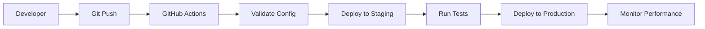

# GitOps CI/CD Guide for Atlas Stream Processing

## Overview

This guide demonstrates how to implement GitOps-style CI/CD for Atlas Stream Processing using the SP tool. GitOps treats your stream processing infrastructure as declarative code, with Git as the single source of truth for all configurations.

## Table of Contents

- [GitOps Fundamentals](#gitops-fundamentals)
- [Repository Structure](#repository-structure)
- [Environment Setup](#environment-setup)
- [GitHub Actions Workflows](#github-actions-workflows)
- [Deployment Strategies](#deployment-strategies)
- [Monitoring & Observability](#monitoring--observability)
- [Security & Best Practices](#security--best-practices)
- [Advanced Patterns](#advanced-patterns)
- [Troubleshooting](#troubleshooting)

## GitOps Fundamentals

### Core Principles
1. **Declarative Configuration**: All processors and connections defined as JSON
2. **Version Controlled**: Complete history and rollback capability via Git
3. **Automated Deployment**: GitHub Actions triggers deployments on Git changes
4. **Continuous Reconciliation**: Regular validation that deployed state matches Git
5. **Observable**: Full audit trail and performance monitoring

### Benefits for Stream Processing
- **Reproducible Deployments**: Identical environments across dev/staging/production
- **Automated Tier Selection**: Optimal resource allocation through `--auto` flag
- **Performance Baselines**: Track processor performance over time
- **Rapid Rollbacks**: Instant rollback to any previous configuration
- **Cost Optimization**: Automated tier recommendations and scaling

## Repository Structure

### Recommended Layout
```
my-stream-processing/
├── .github/
│   └── workflows/
│       ├── ci.yml                    # Pull request validation
│       ├── deploy-staging.yml        # Staging deployment
│       ├── deploy-production.yml     # Production deployment
│       └── performance-monitor.yml   # Continuous monitoring
├── environments/
│   ├── staging/
│   │   ├── config.env               # Staging environment variables
│   │   └── thresholds.json          # Performance thresholds
│   └── production/
│       ├── config.env               # Production environment variables
│       └── thresholds.json          # Performance thresholds
├── processors/
│   ├── analytics_pipeline.json      # Stream processors
│   ├── data_enrichment.json
│   └── alert_system.json
├── connections/
│   ├── data_sources.json            # Input connections
│   └── outputs.json                 # Output connections
└── scripts/
    ├── deploy.sh                    # Deployment helper script
    └── validate.sh                  # Validation script
```

## Environment Setup

### GitHub Secrets Configuration
Configure these secrets in your GitHub repository:

```yaml
# Atlas API Credentials
ATLAS_PUBLIC_KEY_STAGING: "staging_public_key"
ATLAS_PRIVATE_KEY_STAGING: "staging_private_key"
PROJECT_ID_STAGING: "staging_project_id"

ATLAS_PUBLIC_KEY_PRODUCTION: "production_public_key"
ATLAS_PRIVATE_KEY_PRODUCTION: "production_private_key"
PROJECT_ID_PRODUCTION: "production_project_id"

# Notification Credentials (optional)
SLACK_WEBHOOK_URL: "https://hooks.slack.com/..."
```

### Environment-Specific Configuration

#### `environments/staging/config.env`
```bash
ATLAS_PUBLIC_KEY=$ATLAS_PUBLIC_KEY_STAGING
ATLAS_PRIVATE_KEY=$ATLAS_PRIVATE_KEY_STAGING
PROJECT_ID=$PROJECT_ID_STAGING
WORKSPACE_NAME=staging-stream-processing
DEFAULT_TIER=SP10
```

#### `environments/production/config.env`
```bash
ATLAS_PUBLIC_KEY=$ATLAS_PUBLIC_KEY_PRODUCTION
ATLAS_PRIVATE_KEY=$ATLAS_PRIVATE_KEY_PRODUCTION
PROJECT_ID=$PROJECT_ID_PRODUCTION
WORKSPACE_NAME=production-stream-processing
DEFAULT_TIER=auto
```

## GitHub Actions Workflows

### Pull Request Validation (`.github/workflows/ci.yml`)

```yaml
name: Stream Processing CI
on:
  pull_request:
    paths: 
      - 'processors/**'
      - 'connections/**'

jobs:
  validate:
    runs-on: ubuntu-latest
    steps:
      - uses: actions/checkout@v4
      
      - name: Setup Environment
        env:
          ATLAS_PUBLIC_KEY: ${{ secrets.ATLAS_PUBLIC_KEY_STAGING }}
          ATLAS_PRIVATE_KEY: ${{ secrets.ATLAS_PRIVATE_KEY_STAGING }}
          PROJECT_ID: ${{ secrets.PROJECT_ID_STAGING }}
        run: |
          echo "PUBLIC_KEY=$ATLAS_PUBLIC_KEY" > config.txt
          echo "PRIVATE_KEY=$ATLAS_PRIVATE_KEY" >> config.txt
          echo "PROJECT_ID=$PROJECT_ID" >> config.txt
      
      - name: Validate Processor Configurations
        run: |
          cd tools
          ./sp processors test --all
      
      - name: Analyze Tier Requirements
        run: |
          cd tools
          ./sp processors tier-advise --all > tier-analysis.json
      
      - name: Validate Connections
        run: |
          cd tools
          ./sp workspaces connections test --require-mongodb
      
      - name: Comment PR with Analysis
        uses: actions/github-script@v7
        with:
          script: |
            const fs = require('fs');
            if (fs.existsSync('tools/tier-analysis.json')) {
              const analysis = fs.readFileSync('tools/tier-analysis.json', 'utf8');
              github.rest.issues.createComment({
                issue_number: context.issue.number,
                owner: context.repo.owner,
                repo: context.repo.repo,
                body: '## Tier Analysis\n```json\n' + analysis + '\n```'
              });
            }
```

### Staging Deployment (`.github/workflows/deploy-staging.yml`)

```yaml
name: Deploy to Staging
on:
  push:
    branches: [develop]
    paths:
      - 'processors/**'
      - 'connections/**'

jobs:
  deploy-staging:
    runs-on: ubuntu-latest
    environment: staging
    steps:
      - uses: actions/checkout@v4
      
      - name: Setup Staging Environment
        env:
          ATLAS_PUBLIC_KEY: ${{ secrets.ATLAS_PUBLIC_KEY_STAGING }}
          ATLAS_PRIVATE_KEY: ${{ secrets.ATLAS_PRIVATE_KEY_STAGING }}
          PROJECT_ID: ${{ secrets.PROJECT_ID_STAGING }}
        run: |
          source environments/staging/config.env
          echo "PUBLIC_KEY=$ATLAS_PUBLIC_KEY" > config.txt
          echo "PRIVATE_KEY=$ATLAS_PRIVATE_KEY" >> config.txt
          echo "PROJECT_ID=$PROJECT_ID" >> config.txt
      
      - name: Pre-Deployment Snapshot
        run: |
          cd tools
          ./sp processors list > pre-deploy-snapshot.json
          ./sp processors stats --all > pre-deploy-stats.json
      
      - name: Deploy Connections
        run: |
          cd tools
          ./sp workspaces connections create
      
      - name: Deploy Processors
        run: |
          cd tools
          ./sp processors create --all
          ./sp processors start --auto
      
      - name: Post-Deployment Validation
        run: |
          cd tools
          sleep 30  # Allow processors to stabilize
          ./sp processors stats --all
          ./sp processors profile --all --duration 60 --output staging-baseline.json
      
      - name: Store Performance Baseline
        uses: actions/upload-artifact@v4
        with:
          name: staging-performance-baseline
          path: tools/staging-baseline.json
          retention-days: 30
      
      - name: Notify Success
        if: success()
        run: |
          echo "✅ Staging deployment successful"
          # Add Slack notification here if needed
      
      - name: Rollback on Failure
        if: failure()
        run: |
          cd tools
          echo "❌ Deployment failed, rolling back..."
          ./sp processors drop --all
          # Restore previous state if needed
```

### Production Deployment (`.github/workflows/deploy-production.yml`)

```yaml
name: Deploy to Production
on:
  push:
    branches: [main]
    paths:
      - 'processors/**'
      - 'connections/**'

jobs:
  deploy-production:
    runs-on: ubuntu-latest
    environment: 
      name: production
      url: https://cloud.mongodb.com
    steps:
      - uses: actions/checkout@v4
      
      - name: Setup Production Environment
        env:
          ATLAS_PUBLIC_KEY: ${{ secrets.ATLAS_PUBLIC_KEY_PRODUCTION }}
          ATLAS_PRIVATE_KEY: ${{ secrets.ATLAS_PRIVATE_KEY_PRODUCTION }}
          PROJECT_ID: ${{ secrets.PROJECT_ID_PRODUCTION }}
        run: |
          source environments/production/config.env
          echo "PUBLIC_KEY=$ATLAS_PUBLIC_KEY" > config.txt
          echo "PRIVATE_KEY=$ATLAS_PRIVATE_KEY" >> config.txt
          echo "PROJECT_ID=$PROJECT_ID" >> config.txt
      
      - name: Pre-Deployment Health Check
        run: |
          cd tools
          ./sp processors stats --all > pre-deploy-health.json
          ./sp workspaces connections test
      
      - name: Blue-Green Deployment Strategy
        run: |
          cd tools
          
          # Create new processors (green)
          ./sp processors create --all
          
          # Start new processors with auto-tier selection
          ./sp processors start --auto
          
          # Validate new deployment
          sleep 60
          ./sp processors stats --all
          
          # Performance validation
          ./sp processors profile --all --duration 120 --thresholds ../environments/production/thresholds.json
      
      - name: Production Performance Baseline
        run: |
          cd tools
          ./sp processors profile --all --duration 300 --output production-baseline.json
      
      - name: Store Production Metrics
        uses: actions/upload-artifact@v4
        with:
          name: production-performance-${{ github.sha }}
          path: tools/production-baseline.json
          retention-days: 90
      
      - name: Notify Deployment Success
        if: success()
        uses: 8398a7/action-slack@v3
        with:
          status: success
          text: "✅ Production deployment completed successfully"
        env:
          SLACK_WEBHOOK_URL: ${{ secrets.SLACK_WEBHOOK_URL }}
```

## Deployment Strategies

### 1. Basic GitOps Flow



### 2. Feature Branch Strategy

```yaml
# Deploy feature branches to isolated environments
on:
  push:
    branches: 
      - 'feature/*'

jobs:
  feature-deploy:
    runs-on: ubuntu-latest
    steps:
      - name: Create Feature Environment
        run: |
          FEATURE_NAME=$(echo $GITHUB_REF | sed 's/refs\/heads\/feature\///')
          cd tools
          ./sp workspaces create "feature-$FEATURE_NAME"
          ./sp processors create --all
          ./sp processors start --auto
```

### 3. Canary Deployment

```yaml
deploy-canary:
  runs-on: ubuntu-latest
  steps:
    - name: Deploy Canary (10% traffic)
      run: |
        cd tools
        # Deploy new version to subset of processors
        ./sp processors create -p analytics_pipeline_v2
        ./sp processors start -p analytics_pipeline_v2 --auto
        
    - name: Monitor Canary Performance
      run: |
        cd tools
        ./sp processors profile -p analytics_pipeline_v2 --duration 300
        
    - name: Promote or Rollback
      run: |
        # Based on performance metrics, promote or rollback
        # This could be automated based on threshold checks
```

## Monitoring & Observability

### Continuous Performance Monitoring

```yaml
# .github/workflows/performance-monitor.yml
name: Performance Monitoring
on:
  schedule:
    - cron: '0 */6 * * *'  # Every 6 hours

jobs:
  monitor:
    runs-on: ubuntu-latest
    steps:
      - uses: actions/checkout@v4
      
      - name: Setup Environment
        run: |
          echo "PUBLIC_KEY=${{ secrets.ATLAS_PUBLIC_KEY_PRODUCTION }}" > config.txt
          echo "PRIVATE_KEY=${{ secrets.ATLAS_PRIVATE_KEY_PRODUCTION }}" >> config.txt
          echo "PROJECT_ID=${{ secrets.PROJECT_ID_PRODUCTION }}" >> config.txt
      
      - name: Performance Check
        run: |
          cd tools
          ./sp processors profile --all --duration 300 --thresholds ../environments/production/thresholds.json --output monitoring-report.json
      
      - name: Alert on Issues
        if: failure()
        run: |
          # Send alerts for performance issues
          echo "🚨 Performance issues detected in production"
```

### Custom Monitoring Script

```bash
#!/bin/bash
# scripts/monitor.sh

set -e

cd tools

echo "🔍 Monitoring Atlas Stream Processing..."

# Get current processor status
./sp processors stats --all > current-stats.json

# Profile all processors
./sp processors profile --all --duration 120 --output current-performance.json

# Check for any stopped processors
STOPPED=$(./sp processors list | jq '.processors[] | select(.status == "STOPPED") | .name' | wc -l)

if [ $STOPPED -gt 0 ]; then
    echo "⚠️  Warning: $STOPPED processors are stopped"
    ./sp processors list | jq '.processors[] | select(.status == "STOPPED")'
fi

# Performance trend analysis
echo "📊 Performance Summary:"
./sp processors profile --all --duration 60 | jq '.processors | to_entries[] | {name: .key, memory: .value.memory_mb.avg, latency: .value.latency_p99_ms.avg}'

echo "✅ Monitoring complete"
```

## Security & Best Practices

### Secret Management
```yaml
# Use GitHub Environments for secret isolation
environment: 
  name: production
  url: https://cloud.mongodb.com

# Rotate secrets regularly
- name: Validate Secret Rotation
  run: |
    # Check if secrets are older than 90 days
    # Automated secret rotation logic
```

### Configuration Validation
```yaml
- name: Security Scan
  run: |
    # Check for sensitive data in configurations
    grep -r "password\|secret\|key" processors/ && exit 1 || echo "✅ No sensitive data found"
    
    # Validate processor permissions
    cd tools
    ./sp processors test --all --security-check
```

### Access Control
```yaml
# Require manual approval for production
jobs:
  deploy-production:
    environment: 
      name: production
      url: https://cloud.mongodb.com
      # This requires manual approval in GitHub
```

## Advanced Patterns

### Multi-Environment Configuration

```bash
# scripts/deploy.sh
#!/bin/bash

ENVIRONMENT=$1
CONFIG_DIR="environments/$ENVIRONMENT"

if [ ! -d "$CONFIG_DIR" ]; then
    echo "❌ Environment $ENVIRONMENT not found"
    exit 1
fi

# Load environment-specific configuration
source "$CONFIG_DIR/config.env"

echo "🚀 Deploying to $ENVIRONMENT environment..."

cd tools

# Setup configuration
echo "PUBLIC_KEY=$ATLAS_PUBLIC_KEY" > config.txt
echo "PRIVATE_KEY=$ATLAS_PRIVATE_KEY" >> config.txt
echo "PROJECT_ID=$PROJECT_ID" >> config.txt

# Deploy with environment-specific settings
./sp workspaces connections create
./sp processors create --all

if [ "$DEFAULT_TIER" == "auto" ]; then
    ./sp processors start --auto
else
    ./sp processors start --all-tier "$DEFAULT_TIER"
fi

# Validate deployment
./sp processors stats --all
./sp processors profile --all --duration 60 --thresholds "$CONFIG_DIR/thresholds.json"

echo "✅ Deployment to $ENVIRONMENT complete"
```

### Disaster Recovery

```yaml
backup-configuration:
  runs-on: ubuntu-latest
  steps:
    - name: Backup Current State
      run: |
        cd tools
        ./sp processors list > backup/processors-$(date +%Y%m%d).json
        ./sp workspaces connections list > backup/connections-$(date +%Y%m%d).json
        
    - name: Store Backup
      uses: actions/upload-artifact@v4
      with:
        name: configuration-backup-${{ github.sha }}
        path: backup/
```

### Performance Regression Detection

```yaml
regression-test:
  runs-on: ubuntu-latest
  steps:
    - name: Compare Performance
      run: |
        # Download previous baseline
        # Compare current performance against baseline
        # Fail if performance regression detected
        cd tools
        ./sp processors profile --all --duration 180 --output current.json
        
        # Compare with historical data
        python scripts/compare_performance.py baseline.json current.json
```

## Troubleshooting

### Common Issues

#### Deployment Failures
```yaml
- name: Debug Deployment
  if: failure()
  run: |
    cd tools
    echo "📋 Current processor status:"
    ./sp processors list
    
    echo "🔍 Connection status:"
    ./sp workspaces connections list
    
    echo "📊 Resource usage:"
    ./sp processors stats --all --verbose
```

#### Performance Issues
```bash
# Check for performance problems
./sp processors profile --all --duration 300

# Analyze tier recommendations
./sp processors tier-advise --all

# Check for configuration drift
./sp processors stats --all --verbose
```

#### Rollback Procedures
```bash
# Emergency rollback script
#!/bin/bash
echo "🔄 Emergency rollback initiated..."

cd tools

# Stop all processors
./sp processors stop --all

# Drop current processors
./sp processors drop --all

# Checkout previous version
git checkout HEAD~1 -- processors/

# Redeploy previous version
./sp processors create --all
./sp processors start --auto

echo "✅ Rollback complete"
```

### Monitoring Commands

```bash
# Health check script
#!/bin/bash

echo "🏥 Health Check Report"
echo "===================="

cd tools

# Processor health
echo "📊 Processor Status:"
./sp processors list | jq '.summary'

# Performance check
echo "⚡ Performance Check:"
./sp processors profile --all --duration 60 | jq '.processors | to_entries[] | {name: .key, health: .value.recommendations}'

# Connection validation
echo "🔗 Connection Health:"
./sp workspaces connections test

echo "✅ Health check complete"
```

## Best Practices Summary

### Repository Management
- ✅ Use semantic versioning for releases
- ✅ Implement branch protection rules
- ✅ Require pull request reviews
- ✅ Use conventional commit messages

### Configuration Management
- ✅ Keep environment-specific configs separate
- ✅ Use descriptive processor and connection names
- ✅ Document expected performance characteristics
- ✅ Version control all configurations

### Deployment Practices
- ✅ Always validate before deploying to production
- ✅ Use automated tier selection (`--auto`)
- ✅ Implement gradual rollout strategies
- ✅ Monitor performance after deployments

### Security Practices
- ✅ Never commit secrets to Git
- ✅ Use GitHub Environments for access control
- ✅ Rotate API keys regularly
- ✅ Implement least-privilege access

This GitOps approach provides a robust, scalable, and maintainable way to manage Atlas Stream Processing infrastructure with full observability, automated deployments, and reliable rollback capabilities.